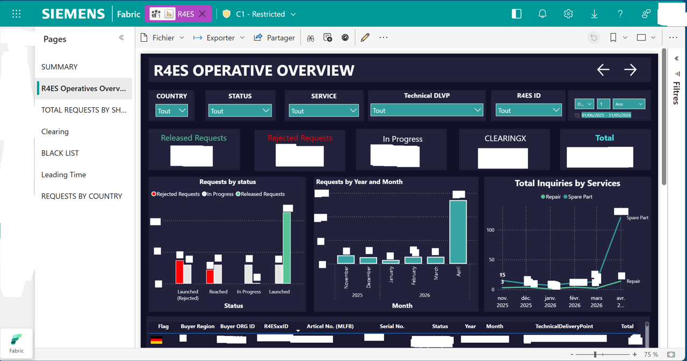

# Siemens - Automated Data Solution & Dashboard

## 📌 Project Overview
Project developed as part of my Master 1 LSCM (Logistics & Supply Chain Management) internship at **Siemens (CS HQ)** (2026). 
The goal was to automate the collection of global logistics data and build a centralized operational tracking tool to monitor requests for extra spares at the HQ level.

## 🛠️ Data Architecture & Engineering (Microsoft Fabric)
I designed and compared two end-to-end data architectures using **Microsoft Fabric** to extract data from multiple sources. 

To ensure optimal performance, **I developed custom SQL views directly on the data lake** to transform and pre-aggregate the data before loading it into the semantic model.

### Architecture Options:
*   **Option 1: Direct Lake Mode (Selected for Speed & Performance) 🚀**
    *Chosen for its speed, allowing the dashboard to query the data lake directly without memory refresh delays, ensuring real-time performance.*
*   **Option 2: Import Mode**

### Option 1: Direct Lake Mode (Selected)

### Option 2: Import Mode

## 📊 Dashboard Structure & Pages
The interactive Power BI report is divided into multiple analytical pages to cover different operational needs of the supply chain:

*   **SUMMARY:** Global high-level overview of the main logistics KPIs.
*   **R4ES Operatives Overview:** Daily operational tracking of active requests (such as "In Progress" or "Rejected").
*   **TOTAL REQUESTS BY SH...:** Volume analysis and breakdown by shipper / shipping point.
*   **Clearing:** Monitoring and resolution of clearing issues and bottlenecks.
*   **BLACK LIST:** Identification and management of blocked orders, restricted entities, or anomalies.
*   **Leading Time:** Deep dive into cycle times, lead times, and overall process responsiveness.
*   **REQUESTS BY COUNTRY:** Geographical distribution of incoming supply chain requests.

*Note: Sensitive company data, volumes, and IDs have been anonymized for confidentiality reasons.*

